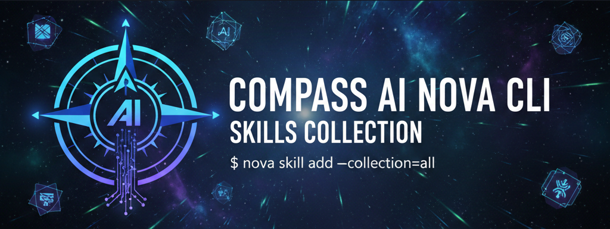

<a href="https://github.com/dherbe-digital/nova-skills-collection">
    
</a>

<br/>
<br/>

<div align="center">
    <strong>The awesome collection of Nova Skills with official and community-built resources.
    </strong>
    <br />
    <br />

</div>

<div align="center">


</div>

# Awesome Nova Skills

## Introduction to Compass Nova CLI

**Compass Nova CLI** is a powerful AI-powered command-line interface that brings intelligent assistance directly to your terminal. Built by Compass AI, Nova enables developers to interact with AI agents that can understand context, execute commands, and help with software development tasks.

🚀 **Get Started:** Install Nova CLI via npm:
```bash
npm install -g @compass-ai/nova
```

📚 **Learn More:** Visit the [Nova CLI package on npm](https://www.npmjs.com/package/@compass-ai/nova)

## About This Repository

This repository contains **Compass AI specific plugins for Nova CLI**. Each plugin is a comprehensive package that may include:

- **Agent Skills** - Reusable instructions and patterns following the **Agent Skills open standard**
- **Nova Sub-Agents** - Specialized AI agents with specific expertise and context
- **Commands** - Custom slash commands for quick access to common workflows  
- **MCP Tools** - Model Context Protocol integrations for external service connections
- **Hooks** - Event-driven automation that triggers on specific actions

### What a Basic Skill Looks Like?

```YAML
---
name: api-tester
description: Test REST APIs and validate responses
---

# API Tester

Test HTTP endpoints and validate response structures.

## When to Use This Skill

Use this skill when you need to test API endpoints and verify response data.

## Instructions

When testing an API:

1. Send a request to the specified endpoint
2. Check the response status code
3. Validate the response body structure
4. Report any errors or unexpected results

## Response Validation

- Verify required fields exist
- Check data types match expected values
- Confirm nested objects have correct structure
```

<br/>

<br/>

## 🎯 Compass Nova Plugins

Explore the **Compass AI specific plugins** available in this repository. Each plugin is a comprehensive package that may include:

- **Agent Skills** - Reusable instructions and patterns following the Agent Skills standard
- **Nova Sub-Agents** - Specialized AI agents with specific expertise and context
- **Commands** - Custom slash commands for quick access to common workflows
- **MCP Tools** - Model Context Protocol integrations for external service connections
- **Hooks** - Event-driven automation that triggers on specific actions

These plugins are optimized for Nova CLI and showcase the full capabilities of the Agent Skills ecosystem.

### SAP Plugins

The repository includes comprehensive SAP-specific plugins under [`plugins/sap/`](plugins/sap/), organized by functional area:

#### AI & Machine Learning
- **[sap-ai-core](plugins/sap/ai-ml/sap-ai-core)** - Skills for SAP AI Core development and deployment
- **[sap-cloud-sdk-ai](plugins/sap/ai-ml/sap-cloud-sdk-ai)** - Integration with SAP Cloud SDK AI capabilities

#### Analytics Cloud
- **[sap-sac-custom-widget](plugins/sap/analytics-cloud/sap-sac-custom-widget)** - Custom widget development for SAP Analytics Cloud with specialized agents, commands, and hooks
- **[sap-sac-planning](plugins/sap/analytics-cloud/sap-sac-planning)** - Planning functionality, data actions, and seamless planning workflows
- **[sap-sac-scripting](plugins/sap/analytics-cloud/sap-sac-scripting)** - Scripting and automation for SAP Analytics Cloud with debugging and optimization tools

#### Analytics & Data
- **[sap-datasphere](plugins/sap/analytics-data/sap-datasphere)** - Data modeling, space management, and integration for SAP Datasphere with CLI tools and MCP integration
- **[sap-hana-cli](plugins/sap/analytics-data/sap-hana-cli)** - Command-line tools for SAP HANA database management
- **[sap-hana-cloud-data-intelligence](plugins/sap/analytics-data/sap-hana-cloud-data-intelligence)** - Data intelligence and pipeline development
- **[sap-hana-ml](plugins/sap/analytics-data/sap-hana-ml)** - Machine learning with SAP HANA

#### BTP Platform
- **[sap-btp-best-practices](plugins/sap/btp-platform/sap-btp-best-practices)** - Best practices for SAP Business Technology Platform
- **[sap-btp-build-work-zone-advanced](plugins/sap/btp-platform/sap-btp-build-work-zone-advanced)** - Advanced Work Zone development
- **[sap-btp-business-application-studio](plugins/sap/btp-platform/sap-btp-business-application-studio)** - Business Application Studio development
- **[sap-btp-cias](plugins/sap/btp-platform/sap-btp-cias)** - Cloud Identity Authentication Service
- **[sap-btp-cloud-logging](plugins/sap/btp-platform/sap-btp-cloud-logging)** - Cloud logging and monitoring
- **[sap-btp-cloud-platform](plugins/sap/btp-platform/sap-btp-cloud-platform)** - Core BTP platform capabilities
- **[sap-btp-cloud-transport-management](plugins/sap/btp-platform/sap-btp-cloud-transport-management)** - Transport management across landscapes
- **[sap-btp-connectivity](plugins/sap/btp-platform/sap-btp-connectivity)** - Connectivity service configuration
- **[sap-btp-developer-guide](plugins/sap/btp-platform/sap-btp-developer-guide)** - Comprehensive developer guide for BTP
- **[sap-btp-integration-suite](plugins/sap/btp-platform/sap-btp-integration-suite)** - Integration Suite development
- **[sap-btp-intelligent-situation-automation](plugins/sap/btp-platform/sap-btp-intelligent-situation-automation)** - Intelligent situation automation
- **[sap-btp-job-scheduling](plugins/sap/btp-platform/sap-btp-job-scheduling)** - Job scheduling service
- **[sap-btp-master-data-integration](plugins/sap/btp-platform/sap-btp-master-data-integration)** - Master data integration
- **[sap-btp-service-manager](plugins/sap/btp-platform/sap-btp-service-manager)** - Service manager operations

#### Cloud Application Model (CAP)
- **[sap-cap-capire](plugins/sap/cloud-application-model/sap-cap-capire)** - SAP Cloud Application Programming Model with specialized agents for CDS modeling, service development, and deployment

#### Development Tools
- **[sap-abap](plugins/sap/development-tools/sap-abap)** - ABAP development skills
- **[sap-abap-cds](plugins/sap/development-tools/sap-abap-cds)** - ABAP Core Data Services
- **[sap-api-style](plugins/sap/development-tools/sap-api-style)** - SAP API style guidelines
- **[sap-fiori-tools](plugins/sap/development-tools/sap-fiori-tools)** - Fiori development tools
- **[sap-sqlscript](plugins/sap/development-tools/sap-sqlscript)** - SQLScript development with AMDP support, procedure generation, and optimization tools

#### UI Frameworks
- **[sapui5](plugins/sap/ui-frameworks/sapui5)** - SAPUI5 framework development with API exploration, app scaffolding, code quality, and migration tools
- **[sapui5-cli](plugins/sap/ui-frameworks/sapui5-cli)** - SAPUI5 command-line interface
- **[sapui5-linter](plugins/sap/ui-frameworks/sapui5-linter)** - SAPUI5 code quality and linting

More skills coming soon! Check back regularly for updates.

<br/>

# Other Recommended Skills Collections
Explore additional skills collections from official sources and the community to enhance your Nova CLI experience.

## Agent Skills Interoperability

The Agent Skills included in these plugins follow the **Agent Skills open standard**, which means:

- ✅ Skills created for Claude Code work with Nova
- ✅ Skills created for Gemini CLI work with Nova  
- ✅ Skills created for Nova work with other Agent Skills-compatible tools
- ✅ Full interoperability across the Agent Skills ecosystem

> **Note:** For information about the Agent Skills standard, see [agentskills.io](https://agentskills.io).

Agent Skills are folders with instructions, scripts, and resources that teach AI agents specific tasks. Skills can include executable code and are loaded only when needed, allowing you to maintain hundreds without performance impact. Multiple skills can run together for complex tasks like document creation, code testing, and data analysis.

## Skills Paths for Other AI Coding Assistants

| Tool | Project Path | Global Path | Official Docs |
|------|-------------|-------------|---------------|
| Antigravity | `.agent/skills/` | `~/.gemini/antigravity/skills/` | [Antigravity Skills](https://antigravity.google/docs/skills) |
| Claude Code | `.claude/skills/` | `~/.claude/skills/` | [Claude Code Skills](https://docs.anthropic.com/en/docs/claude-code/skills) |
| Codex | `.codex/skills/` | `~/.codex/skills/` | [Codex Skills](https://developers.openai.com/codex/skills) |
| Compass Nova | `.compass/skills/` | `~/.compass/skills/` | [Nova CLI Skills](https://www.npmjs.com/package/@compass-ai/nova) |
| Cursor | `.cursor/skills/` | `~/.cursor/skills/` | [Cursor Skills](https://cursor.com/docs/context/skills) |
| Gemini CLI | `.gemini/skills/` | `~/.gemini/skills/` | [Gemini CLI Skills](https://geminicli.com/docs/cli/skills/) |
| GitHub Copilot | `.github/skills/` | `~/.copilot/skills/` | [Copilot Skills](https://docs.github.com/en/copilot/concepts/agents/about-agent-skills) |
| OpenCode | `.opencode/skills/` | `~/.config/opencode/skills/` | [OpenCode Skills](https://opencode.ai/docs/skills) |
| Windsurf | `.windsurf/skills/` | `~/.codeium/windsurf/skills/` | [Windsurf Cascade Skills](https://docs.windsurf.com/windsurf/cascade/skills) |

## Official Claude Skills

### Document Creation

- **[anthropics/docx](https://github.com/anthropics/skills/tree/main/skills/docx)** - Create, edit, and analyze Word documents
- **[anthropics/doc-coauthoring](https://github.com/anthropics/skills/tree/main/skills/doc-coauthoring)** - Collaborative document editing and co-authoring
- **[anthropics/pptx](https://github.com/anthropics/skills/tree/main/skills/pptx)** - Create, edit, and analyze PowerPoint presentations
- **[anthropics/xlsx](https://github.com/anthropics/skills/tree/main/skills/xlsx)** - Create, edit, and analyze Excel spreadsheets
- **[anthropics/pdf](https://github.com/anthropics/skills/tree/main/skills/pdf)** - Extract text, create PDFs, and handle forms

### Creative and Design

- **[anthropics/algorithmic-art](https://github.com/anthropics/skills/tree/main/skills/algorithmic-art)** - Create generative art using p5.js with seeded randomness
- **[anthropics/canvas-design](https://github.com/anthropics/skills/tree/main/skills/canvas-design)** - Design visual art in PNG and PDF formats
- **[anthropics/frontend-design](https://github.com/anthropics/skills/tree/main/skills/frontend-design)** - Frontend design and UI/UX development tools
- **[anthropics/slack-gif-creator](https://github.com/anthropics/skills/tree/main/skills/slack-gif-creator)** - Create animated GIFs optimized for Slack size constraints
- **[anthropics/theme-factory](https://github.com/anthropics/skills/tree/main/skills/theme-factory)** - Style artifacts with professional themes or generate custom themes

### Development

- **[anthropics/web-artifacts-builder](https://github.com/anthropics/skills/tree/main/skills/web-artifacts-builder)** - Build complex claude.ai HTML artifacts with React and Tailwind
- **[anthropics/mcp-builder](https://github.com/anthropics/skills/tree/main/skills/mcp-builder)** - Create MCP servers to integrate external APIs and services
- **[anthropics/webapp-testing](https://github.com/anthropics/skills/tree/main/skills/webapp-testing)** - Test local web applications using Playwright

### Branding and Communication

- **[anthropics/brand-guidelines](https://github.com/anthropics/skills/tree/main/skills/brand-guidelines)** - Apply Anthropic's brand colors and typography to artifacts
- **[anthropics/internal-comms](https://github.com/anthropics/skills/tree/main/skills/internal-comms)** - Write status reports, newsletters, and FAQs

### Meta

- **[anthropics/skill-creator](https://github.com/anthropics/skills/tree/main/skills/skill-creator)** - Guide for creating skills that extend Claude's capabilities
- **[anthropics/template](https://github.com/anthropics/skills/tree/main/template)** - Basic template for creating new skills

## Skills by Google Labs (Stitch)

Agent Skills for the Stitch MCP server, compatible with Claude Code, Gemini CLI, Cursor, and more.

- **[google-labs-code/design-md](https://github.com/google-labs-code/stitch-skills/tree/main/skills/design-md)** - Create and manage DESIGN.md files
- **[google-labs-code/react-components](https://github.com/google-labs-code/stitch-skills/tree/main/skills/react-components)** - Stitch to React components conversion

## Skills by Vercel Engineering Team

- **[vercel-labs/react-best-practices](https://github.com/vercel-labs/agent-skills/tree/main/skills/react-best-practices)** - React best practices and patterns
- **[vercel-labs/vercel-deploy-claimable](https://github.com/vercel-labs/agent-skills/tree/main/skills/claude.ai/vercel-deploy-claimable)** - Deploy projects to Vercel
- **[vercel-labs/web-design-guidelines](https://github.com/vercel-labs/agent-skills/tree/main/skills/web-design-guidelines)** - Web design guidelines and standards

## Security Skills by Trail of Bits Team

- **[trailofbits/ask-questions-if-underspecified](https://github.com/trailofbits/skills/tree/main/plugins/ask-questions-if-underspecified)** - Prompt for clarification on ambiguous requirements
- **[trailofbits/audit-context-building](https://github.com/trailofbits/skills/tree/main/plugins/audit-context-building)** - Deep architectural context via ultra-granular code analysis
- **[trailofbits/building-secure-contracts](https://github.com/trailofbits/skills/tree/main/plugins/building-secure-contracts)** - Smart contract security toolkit with vulnerability scanners for 6 blockchains
- **[trailofbits/burpsuite-project-parser](https://github.com/trailofbits/skills/tree/main/plugins/burpsuite-project-parser)** - Search and extract data from Burp Suite project files
- **[trailofbits/constant-time-analysis](https://github.com/trailofbits/skills/tree/main/plugins/constant-time-analysis)** - Detect compiler-induced timing side-channels in crypto code
- **[trailofbits/culture-index](https://github.com/trailofbits/skills/tree/main/plugins/culture-index)** - Index and search culture documentation
- **[trailofbits/differential-review](https://github.com/trailofbits/skills/tree/main/plugins/differential-review)** - Security-focused diff review with git history analysis
- **[trailofbits/dwarf-expert](https://github.com/trailofbits/skills/tree/main/plugins/dwarf-expert)** - DWARF debugging format expertise
- **[trailofbits/entry-point-analyzer](https://github.com/trailofbits/skills/tree/main/plugins/entry-point-analyzer)** - Identify state-changing entry points in smart contracts
- **[trailofbits/fix-review](https://github.com/trailofbits/skills/tree/main/plugins/fix-review)** - Verify fix commits address audit findings without new bugs
- **[trailofbits/property-based-testing](https://github.com/trailofbits/skills/tree/main/plugins/property-based-testing)** - Property-based testing for multiple languages and smart contracts
- **[trailofbits/semgrep-rule-creator](https://github.com/trailofbits/skills/tree/main/plugins/semgrep-rule-creator)** - Create and refine Semgrep rules for vulnerability detection
- **[trailofbits/sharp-edges](https://github.com/trailofbits/skills/tree/main/plugins/sharp-edges)** - Identify error-prone APIs and dangerous configurations
- **[trailofbits/spec-to-code-compliance](https://github.com/trailofbits/skills/tree/main/plugins/spec-to-code-compliance)** - Specification-to-code compliance checker for blockchain audits
- **[trailofbits/static-analysis](https://github.com/trailofbits/skills/tree/main/plugins/static-analysis)** - Static analysis toolkit with CodeQL, Semgrep, and SARIF
- **[trailofbits/testing-handbook-skills](https://github.com/trailofbits/skills/tree/main/plugins/testing-handbook-skills)** - Testing Handbook skills: fuzzers, static analysis, sanitizers
- **[trailofbits/variant-analysis](https://github.com/trailofbits/skills/tree/main/plugins/variant-analysis)** - Find similar vulnerabilities via pattern-based analysis


## Skills by Sentry team for their dev team.

- **[getsentry/agents-md](https://github.com/getsentry/skills/tree/main/plugins/sentry-skills/skills/agents-md)** - Generate and manage AGENTS.md files
- **[getsentry/claude-settings-audit](https://github.com/getsentry/skills/tree/main/plugins/sentry-skills/skills/claude-settings-audit)** - Audit Claude settings configuration
- **[getsentry/code-review](https://github.com/getsentry/skills/tree/main/plugins/sentry-skills/skills/code-review)** - Perform code reviews
- **[getsentry/commit](https://github.com/getsentry/skills/tree/main/plugins/sentry-skills/skills/commit)** - Create commits with best practices
- **[getsentry/create-pr](https://github.com/getsentry/skills/tree/main/plugins/sentry-skills/skills/create-pr)** - Create pull requests
- **[getsentry/find-bugs](https://github.com/getsentry/skills/tree/main/plugins/sentry-skills/skills/find-bugs)** - Find and identify bugs in code
- **[getsentry/iterate-pr](https://github.com/getsentry/skills/tree/main/plugins/sentry-skills/skills/iterate-pr)** - Iterate on pull request feedback

## Skills by Cloudflare Team

- **[cloudflare/agents-sdk](https://github.com/cloudflare/skills/tree/main/agents-sdk)** - Build stateful AI agents with scheduling, RPC, MCP servers, email, and streaming chat
- **[cloudflare/building-ai-agent-on-cloudflare](https://github.com/cloudflare/skills/tree/main/building-ai-agent-on-cloudflare)** - Build AI agents with state, WebSockets, and tool integration
- **[cloudflare/building-mcp-server-on-cloudflare](https://github.com/cloudflare/skills/tree/main/building-mcp-server-on-cloudflare)** - Build remote MCP servers with tools, OAuth, and deployment
- **[cloudflare/commands](https://github.com/cloudflare/skills/tree/main/commands)** - Cloudflare CLI commands reference
- **[cloudflare/durable-objects](https://github.com/cloudflare/skills/tree/main/durable-objects)** - Stateful coordination (chat, games, booking), RPC, SQLite, alarms, WebSockets
- **[cloudflare/web-perf](https://github.com/cloudflare/skills/tree/main/web-perf)** - Audit Core Web Vitals (FCP, LCP, TBT, CLS), render-blocking resources, network chains
- **[cloudflare/wrangler](https://github.com/cloudflare/skills/tree/main/wrangler)** - Deploy and manage Workers, KV, R2, D1, Vectorize, Queues, Workflows

## Skill by Cloudflare Engineer

- **[dmmulroy/cloudflare-skill](https://github.com/dmmulroy/cloudflare-skill/tree/main/skill/cloudflare)** - Comprehensive Cloudflare platform reference docs for AI/LLM consumption. Covers Workers, Pages, storage (KV, D1, R2), AI (Workers AI, Vectorize, Agents SDK), networking, security, and infrastructure-as-code.

## Skills by Stripe Team

- **[stripe/stripe-best-practices](https://github.com/stripe/ai/tree/main/skills/stripe-best-practices)** - Best practices for building Stripe integrations
- **[stripe/upgrade-stripe](https://github.com/stripe/ai/tree/main/skills/upgrade-stripe)** - Upgrade Stripe SDK and API versions

## Skills by Better Auth Team

- **[better-auth/best-practices](https://github.com/better-auth/skills/tree/main/better-auth/best-practices)** - Best practices for Better Auth integration
- **[better-auth/commands](https://github.com/better-auth/skills/tree/main/better-auth/commands)** - Better Auth CLI commands
- **[better-auth/create-auth](https://github.com/better-auth/skills/tree/main/better-auth/create-auth)** - Create authentication setup with Better Auth

## Skills by Tinybird Team

- **[tinybirdco/tinybird-best-practices](https://github.com/tinybirdco/tinybird-agent-skills/tree/main/skills/tinybird-best-practices)** - Tinybird project guidelines with 18 rules for datasources, pipes, endpoints, SQL, and deployments

## Skills by Neon Team

- **[neondatabase/using-neon](https://github.com/neondatabase/agent-skills/tree/main/skills/using-neon)** - Best practices for Neon Serverless Postgres

## Skills by Supabase Team

- **[supabase/postgres-best-practices](https://github.com/supabase/agent-skills/tree/main/skills/postgres-best-practices)** - PostgreSQL best practices for Supabase

## Skills by Hugging Face Team

Official AI agent skills from the Hugging Face team for ML workflows.

- **[huggingface/hugging-face-cli](https://github.com/huggingface/skills/tree/main/skills/hugging-face-cli)** - HF Hub CLI for models, datasets, repos, and compute jobs
- **[huggingface/hugging-face-datasets](https://github.com/huggingface/skills/tree/main/skills/hugging-face-datasets)** - Create and manage datasets with configs and SQL querying
- **[huggingface/hugging-face-evaluation](https://github.com/huggingface/skills/tree/main/skills/hugging-face-evaluation)** - Model evaluation with vLLM/lighteval and eval tables
- **[huggingface/hugging-face-jobs](https://github.com/huggingface/skills/tree/main/skills/hugging-face-jobs)** - Run compute jobs and Python scripts on HF infrastructure
- **[huggingface/hugging-face-model-trainer](https://github.com/huggingface/skills/tree/main/skills/hugging-face-model-trainer)** - Train models with TRL: SFT, DPO, GRPO, GGUF conversion
- **[huggingface/hugging-face-paper-publisher](https://github.com/huggingface/skills/tree/main/skills/hugging-face-paper-publisher)** - Publish papers on HF Hub with model/dataset links
- **[huggingface/hugging-face-tool-builder](https://github.com/huggingface/skills/tree/main/skills/hugging-face-tool-builder)** - Build reusable scripts for HF API operations
- **[huggingface/hugging-face-trackio](https://github.com/huggingface/skills/tree/main/skills/hugging-face-trackio)** - Track ML experiments with real-time dashboards

## Skills by Expo Team

Official AI agent skills from the Expo team for building, deploying, and debugging Expo apps.

- **[expo/expo-app-design](https://github.com/expo/skills/tree/main/plugins/expo-app-design)** - Design and build Expo applications
- **[expo/expo-deployment](https://github.com/expo/skills/tree/main/plugins/expo-deployment)** - Deploy Expo apps to production
- **[expo/upgrading-expo](https://github.com/expo/skills/tree/main/plugins/upgrading-expo)** - Upgrade Expo SDK versions

## Marketing Skills

- **[coreyhaines31/marketingskills](https://github.com/coreyhaines31/marketingskills)** - 23+ marketing skills covering SEO, copywriting, email sequences, A/B testing, paid ads, pricing strategy, and CRO

## Community Skills

### Productivity and Collaboration

- **[notiondevs/Notion Skills for Claude](https://www.notion.so/notiondevs/Notion-Skills-for-Claude-28da4445d27180c7af1df7d8615723d0)** - Skills for working with Notion
- **[op7418/NanoBanana-PPT-Skills](https://github.com/op7418/NanoBanana-PPT-Skills)** - AI-powered PPT generation with document analysis, styled images, and optional video transitions
- **[PleasePrompto/notebooklm-skill](https://github.com/PleasePrompto/notebooklm-skill)** - Interact with NotebookLM for document-based conversations
- **[obra/superpowers-lab](https://github.com/obra/superpowers-lab)** - Lab environment for Claude superpowers
- **[obra/brainstorming](https://github.com/obra/superpowers/blob/main/skills/brainstorming/SKILL.md)** - Generate and explore ideas
- **[obra/writing-plans](https://github.com/obra/superpowers/blob/main/skills/writing-plans/SKILL.md)** - Create strategic documentation
- **[obra/executing-plans](https://github.com/obra/superpowers/blob/main/skills/executing-plans/SKILL.md)** - Implement and run strategic plans
- **[obra/dispatching-parallel-agents](https://github.com/obra/superpowers/blob/main/skills/dispatching-parallel-agents/SKILL.md)** - Coordinate multiple simultaneous agents
- **[obra/sharing-skills](https://github.com/obra/superpowers/blob/main/skills/sharing-skills/SKILL.md)** - Distribute and communicate capabilities
- **[obra/using-superpowers](https://github.com/obra/superpowers/blob/main/skills/using-superpowers/SKILL.md)** - Leverage core platform capabilities
- **[ComposioHQ/content-research-writer](https://github.com/ComposioHQ/awesome-claude-skills/tree/master/content-research-writer)** - Enhance writing with research
- **[ComposioHQ/meeting-insights-analyzer](https://github.com/ComposioHQ/awesome-claude-skills/tree/master/meeting-insights-analyzer)** - Analyze meeting communication patterns
- **[ComposioHQ/competitive-ads-extractor](https://github.com/ComposioHQ/awesome-claude-skills/tree/master/competitive-ads-extractor)** - Analyze competitor advertising
- **[ComposioHQ/image-enhancer](https://github.com/ComposioHQ/awesome-claude-skills/tree/master/image-enhancer)** - Improve image quality
- **[wrsmith108/linear-claude-skill](https://github.com/wrsmith108/linear-claude-skill)** - Manage Linear issues, projects, and teams with MCP tools, SDK scripts, and GraphQL fallbacks
- **[wshuyi/x-article-publisher-skill](https://github.com/wshuyi/x-article-publisher-skill)** - Publish articles to X/Twitter

### Development and Testing

- **[antonbabenko/terraform-skill](https://github.com/antonbabenko/terraform-skill)** - Terraform infrastructure as code best practices
- **[zxkane/aws-skills](https://github.com/zxkane/aws-skills)** - AWS development with infrastructure automation and cloud architecture patterns
- **[conorluddy/ios-simulator-skill](https://github.com/conorluddy/ios-simulator-skill)** - Control iOS Simulator
- **[sanjay3290/postgres](https://github.com/sanjay3290/ai-skills/tree/main/skills/postgres)** - Execute safe read-only SQL queries against PostgreSQL databases with multi-connection support
- **[sanjay3290/deep-research](https://github.com/sanjay3290/ai-skills/tree/main/skills/deep-research)** - Execute autonomous multi-step research using Gemini Deep Research Agent for market analysis and literature reviews
- **[jthack/ffuf-claude-skill](https://github.com/jthack/ffuf_claude_skill)** - Web fuzzing with ffuf
- **[lackeyjb/playwright-skill](https://github.com/lackeyjb/playwright-skill)** - Browser automation with Playwright
- **[ibelick/ui-skills](https://github.com/ibelick/ui-skills)** - Opinionated, evolving constraints to guide agents when building interfaces
- **[nextlevelbuilder/ui-ux-pro-max-skill](https://github.com/nextlevelbuilder/ui-ux-pro-max-skill)** - UI/UX design patterns and best practices
- **[scarletkc/vexor](https://github.com/scarletkc/vexor)** - Vector-powered CLI for semantic file search with a Claude/Codex skill
- **[obra/test-driven-development](https://github.com/obra/superpowers/blob/main/skills/test-driven-development/SKILL.md)** - Write tests before implementing code
- **[ComposioHQ/changelog-generator](https://github.com/ComposioHQ/awesome-claude-skills/tree/master/changelog-generator)** - Transform git commits into release notes
- **[obra/subagent-driven-development](https://github.com/obra/superpowers/blob/main/skills/subagent-driven-development/SKILL.md)** - Development using multiple sub-agents
- **[obra/systematic-debugging](https://github.com/obra/superpowers/blob/main/skills/systematic-debugging/SKILL.md)** - Methodical problem-solving in code
- **[obra/root-cause-tracing](https://github.com/obra/superpowers/blob/main/skills/root-cause-tracing/SKILL.md)** - Investigate and identify fundamental problems
- **[obra/testing-skills-with-subagents](https://github.com/obra/superpowers/blob/main/skills/testing-skills-with-subagents/SKILL.md)** - Collaborative testing approaches
- **[obra/testing-anti-patterns](https://github.com/obra/superpowers/blob/main/skills/testing-anti-patterns/SKILL.md)** - Identify ineffective testing practices
- **[obra/finishing-a-development-branch](https://github.com/obra/superpowers/blob/main/skills/finishing-a-development-branch/SKILL.md)** - Complete Git code branches
- **[obra/requesting-code-review](https://github.com/obra/superpowers/blob/main/skills/requesting-code-review/SKILL.md)** - Initiate code review processes
- **[obra/receiving-code-review](https://github.com/obra/superpowers/blob/main/skills/receiving-code-review/SKILL.md)** - Process and incorporate code feedback
- **[obra/using-git-worktrees](https://github.com/obra/superpowers/blob/main/skills/using-git-worktrees/SKILL.md)** - Manage multiple Git working trees
- **[obra/verification-before-completion](https://github.com/obra/superpowers/blob/main/skills/verification-before-completion/SKILL.md)** - Validate work before finalizing
- **[obra/condition-based-waiting](https://github.com/obra/superpowers/blob/main/skills/condition-based-waiting/SKILL.md)** - Manage conditional pauses or delays
- **[obra/commands](https://github.com/obra/superpowers/tree/main/skills/commands)** - Create and manage command structures
- **[obra/writing-skills](https://github.com/obra/superpowers/blob/main/skills/writing-skills/SKILL.md)** - Develop and document capabilities
- **[fvadicamo/dev-agent-skills](https://github.com/fvadicamo/dev-agent-skills)** - Git and GitHub workflow skills: git-commit (Conventional Commits), github-pr-creation, github-pr-merge, github-pr-review, plus creating-skills guide
- **[omkamal/pypict-skill](https://github.com/omkamal/pypict-claude-skill/blob/main/SKILL.md)** - Pairwise test generation
- **[alinaqi/claude-bootstrap](https://github.com/alinaqi/claude-bootstrap)** - Opinionated project initialization with security-first guardrails, spec-driven atomic todos, LLM testing patterns, and CLI tool orchestration (gh, vercel, supabase)
- **[ZhangHanDong/makepad-skills](https://github.com/ZhangHanDong/makepad-skills)** - Makepad UI development skills for Rust apps: setup, patterns, shaders, packaging, and troubleshooting.
- **[callstackincubator/react-native-best-practices](https://github.com/callstackincubator/agent-skills/blob/main/skills/react-native-best-practices/SKILL.md)** - Performance optimization for React Native apps from Callstack
- **[CloudAI-X/threejs-skills](https://github.com/CloudAI-X/threejs-skills)** - A curated collection of Three.js skill files that provide Claude Code with foundational knowledge for creating 3D elements and interactive experiences.

### Context Engineering

- **[muratcankoylan/context-fundamentals](https://github.com/muratcankoylan/Agent-Skills-for-Context-Engineering/tree/main/skills/context-fundamentals)** - Understand what context is, why it matters, and the anatomy of context in agent systems
- **[muratcankoylan/context-degradation](https://github.com/muratcankoylan/Agent-Skills-for-Context-Engineering/tree/main/skills/context-degradation)** - Recognize patterns of context failure: lost-in-middle, poisoning, distraction, and clash
- **[muratcankoylan/context-compression](https://github.com/muratcankoylan/Agent-Skills-for-Context-Engineering/tree/main/skills/context-compression)** - Design and evaluate compression strategies for long-running sessions
- **[muratcankoylan/context-optimization](https://github.com/muratcankoylan/Agent-Skills-for-Context-Engineering/tree/main/skills/context-optimization)** - Apply compaction, masking, and caching strategies
- **[muratcankoylan/multi-agent-patterns](https://github.com/muratcankoylan/Agent-Skills-for-Context-Engineering/tree/main/skills/multi-agent-patterns)** - Master orchestrator, peer-to-peer, and hierarchical multi-agent architectures
- **[muratcankoylan/memory-systems](https://github.com/muratcankoylan/Agent-Skills-for-Context-Engineering/tree/main/skills/memory-systems)** - Design short-term, long-term, and graph-based memory architectures
- **[muratcankoylan/tool-design](https://github.com/muratcankoylan/Agent-Skills-for-Context-Engineering/tree/main/skills/tool-design)** - Build tools that agents can use effectively, including architectural reduction patterns
- **[muratcankoylan/evaluation](https://github.com/muratcankoylan/Agent-Skills-for-Context-Engineering/tree/main/skills/evaluation)** - Build evaluation frameworks for agent systems

### Specialized Domains

- **[K-Dense-AI/claude-scientific-skills](https://github.com/K-Dense-AI/claude-scientific-skills)** - Scientific research and analysis skills
- **[NotMyself/claude-win11-speckit-update-skill](https://github.com/NotMyself/claude-win11-speckit-update-skill)** - Windows 11 system management
- **[sanjay3290/imagen](https://github.com/sanjay3290/ai-skills/tree/main/skills/imagen)** - Generate images using Google Gemini's API for UI mockups, icons, and visual assets
- **[jeffersonwarrior/claudisms](https://github.com/jeffersonwarrior/claudisms)** - SMS messaging integration
- **[SHADOWPR0/security-bluebook-builder](https://github.com/SHADOWPR0/security-bluebook-builder)** - Build a concise, normative security Blue Book for sensitive apps (threat model, data classes, auth/session, logging/audit, retention, IR, security gates)
- **[obra/defense-in-depth](https://github.com/obra/superpowers/blob/main/skills/defense-in-depth/SKILL.md)** - Multi-layered security approaches
- **[huifer/Claude-Ally-Health](https://github.com/huifer/Claude-Ally-Health)** - A health assistant skill for medical information analysis, symptom tracking, and wellness guidance.
- **[frmoretto/clarity-gate](https://github.com/frmoretto/clarity-gate)** - Pre-ingestion verification for epistemic quality in RAG systems with 9-point verification and Two-Round HITL workflow


  
### n8n Automation

- **[czlonkowski/n8n-code-javascript](https://github.com/czlonkowski/n8n-skills/tree/main/skills/n8n-code-javascript)** - JavaScript in n8n Code nodes with data access patterns
- **[czlonkowski/n8n-code-python](https://github.com/czlonkowski/n8n-skills/tree/main/skills/n8n-code-python)** - Python coding in n8n Code nodes with limitations
- **[czlonkowski/n8n-expression-syntax](https://github.com/czlonkowski/n8n-skills/tree/main/skills/n8n-expression-syntax)** - n8n expression syntax with {{}} and $json/$node variables
- **[czlonkowski/n8n-mcp-tools-expert](https://github.com/czlonkowski/n8n-skills/tree/main/skills/n8n-mcp-tools-expert)** - MCP tools guide with tool selection and node formats
- **[czlonkowski/n8n-node-configuration](https://github.com/czlonkowski/n8n-skills/tree/main/skills/n8n-node-configuration)** - Node configuration with dependency rules and AI connections
- **[czlonkowski/n8n-validation-expert](https://github.com/czlonkowski/n8n-skills/tree/main/skills/n8n-validation-expert)** - Fix n8n validation errors with error catalog
- **[czlonkowski/n8n-workflow-patterns](https://github.com/czlonkowski/n8n-skills/tree/main/skills/n8n-workflow-patterns)** - Workflow patterns for webhook, HTTP, database, and AI tasks

### Other

- **[materials-simulation-skills](https://github.com/HeshamFS/materials-simulation-skills)** - Agent skills for computational materials science: numerical stability, time-stepping, linear solvers, mesh generation, simulation validation, parameter optimization, and post-processing
- **[wrsmith108/varlock-claude-skill](https://github.com/wrsmith108/varlock-claude-skill)** - Secure environment variable management ensuring secrets are never exposed in Claude sessions, terminals, logs, or git commits
- **[SHADOWPR0/beautiful_prose](https://github.com/SHADOWPR0/beautiful_prose)** - Hard-edged writing style contract for timeless, forceful English prose without AI tics

## 🤝 Contributing

We welcome contributions! See [CONTRIBUTING.md](CONTRIBUTING.md) for guidelines.

- Submit new skills via PR
- Improve existing definitions

**Note:** Please don't submit skills you created 3 hours ago. We're now focusing on community-adopted skills, especially those published by development teams and proven in real-world usage. Quality over quantity.

* This is a curated list. We do not audit, endorse, or guarantee the security or correctness of listed projects.
